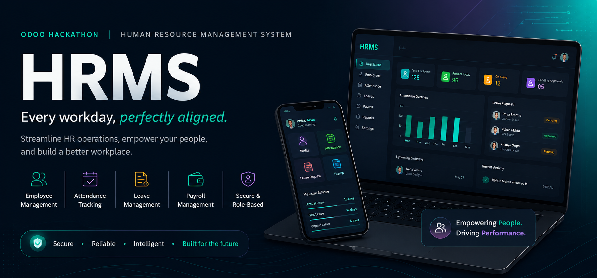

<div align="center">



<br/>


**A digitized, role-aware HR platform** — onboarding, attendance, leave, and payroll, unified behind one clean API.

[Demo](#demo) · [Problem](#problem-statement) · [Architecture](#architecture) · [Getting Started](#getting-started) · [Roadmap](#roadmap) · [Team](#team)

</div>

<br/>

## Demo

> **Video walkthrough:** _coming soon._ We'll drop the recording (auth → check-in/out → leave approval → payroll) here once it's cut.

<!--
Swap the line above for one of these once the video is ready:

  [](https://youtu.be/VIDEO_ID)

  or, for a file committed to the repo:

  https://github.com/CyberKnight-cmd/human-resource-management/assets/VIDEO_PATH.mp4
-->

<br/>

## Problem Statement

HR operations at most small-to-mid orgs are scattered across spreadsheets, chat threads, and email approvals — nobody has one place to check in, request leave, or see whether payroll is accurate. **HRMS** consolidates it into one system with two lenses on the same data: an **Employee** view (profile, attendance, leave, read-only payroll) and an **Admin/HR** view (org-wide attendance, leave approvals, payroll control), built on secure authentication and strict role-based access from the ground up.

## Features

| Area | What it does |
|---|---|
| **Authentication** | Sign up with employee ID + email + role, enforced password rules, email verification gate, JWT access + refresh tokens with rotation and revocation on logout. |
| **Role-based access** | Every route is scoped to `admin` or `employee`; object-level checks stop an employee from ever reading someone else's records, even with a valid token. |
| **Employee profiles** | View personal/job details, salary structure, documents, and photo. Employees edit their own contact fields; admins edit everything. |
| **Attendance** | Check-in / check-out, daily and weekly views, status auto-derived (present / absent / half-day / leave) — never client-chosen. |
| **Leave & time-off** | Apply by calendar range with type and remarks; admin approve/reject with comments instantly updates balances *and* the attendance calendar. |
| **Payroll** | Read-only for employees; admins update salary structures as new *versions* (full history preserved), never overwritten in place. |
| **Audit trail** | Every approval, rejection, and admin-side edit is logged with actor, action, and target for accountability. |

## Architecture

Layered, module-per-feature backend — routers never touch the database directly, and every layer only talks to the one beneath it:

```
Router  →  Service  →  Repository  →  SQLAlchemy Model  →  SQLite (dev) / PostgreSQL (prod)
 (HTTP)     (rules)      (queries)        (schema)
```

Full design docs live in [`Architecture/`](Architecture):

| Doc | Covers |
|---|---|
| [`Overall_Architecture.md`](Architecture/Overall_Architecture.md) | System-wide component diagram (frontend → API → services → DB) |
| [`BACKEND_ARCHITECTURE.md`](Architecture/BACKEND_ARCHITECTURE.md) | Full backend spec — schema, JWT claim shapes, API surface, team split |
| [`BACKEND_LAYER_ARCHITECTURE.md`](Architecture/BACKEND_LAYER_ARCHITECTURE.md) | Router → Service → Repository → Model contract |
| [`DB_Relationship.md`](Architecture/DB_Relationship.md) | Entity relationships at a glance |
| [`Authentication_Flow.md`](Architecture/Authentication_Flow.md) | Signup, verification, login, refresh, logout |
| [`Attendance_Flow.md`](Architecture/Attendance_Flow.md) · [`Leave_Management_Flow.md`](Architecture/Leave_Management_Flow.md) · [`Payroll_Flow.md`](Architecture/Payroll_Flow.md) · [`Employee_Profile_flow.md`](Architecture/Employee_Profile_flow.md) · [`Admin_management_flow.md`](Architecture/Admin_management_flow.md) | Per-module flows |
| [`Complete_Process_Flow.md`](Architecture/Complete_Process_Flow.md) | End-to-end walkthrough |

## Tech Stack

| Layer | Choice |
|---|---|
| API framework | FastAPI (async), Python 3.12+ |
| ORM / migrations | SQLAlchemy 2.0 (async) + Alembic |
| Database | SQLite by default for local dev (zero setup) · PostgreSQL in production |
| Package/project manager | [uv](https://docs.astral.sh/uv/) — `pyproject.toml` + `uv.lock` |
| Auth | JWT (`python-jose`) — short-lived access token, rotating/revocable refresh token — `passlib[bcrypt]` for hashing |
| Validation | Pydantic v2 |
| Containerization | Docker + Docker Compose |
| Frontend *(planned)* | React / Next.js consuming the REST API over HTTPS |

## Repository Structure

```
.
├── Architecture/          # design docs — read these before touching a module
├── backend/
│   └── app/
│       ├── core/          # config, JWT security, exceptions, auth dependencies
│       ├── db/            # async engine + session
│       ├── models/        # SQLAlchemy tables
│       ├── common/        # enums, pagination, audit logging
│       └── modules/       # auth · users · attendance · leave · payroll · dashboard
│           └── <module>/  # schemas.py · repository.py · service.py · router.py
└── docs/assets/           # README banner, future screenshots/video
```

## Getting Started

**Prerequisite:** [uv](https://docs.astral.sh/uv/) — a fast Python package/project manager. Install it once per machine:

```bash
# macOS / Linux
curl -LsSf https://astral.sh/uv/install.sh | sh

# Windows (PowerShell)
powershell -ExecutionPolicy ByPass -c "irm https://astral.sh/uv/install.ps1 | iex"
```

Then, from a fresh clone:

```bash
git clone https://github.com/CyberKnight-cmd/human-resource-management.git
cd human-resource-management/backend

cp .env.example .env            # defaults already work for local dev — edit only if you need real secrets
uv sync --group dev             # creates backend/.venv and installs everything pinned in uv.lock
                                 # (uv also fetches the right Python version automatically if you don't have one)

uv run uvicorn app.main:app --reload   # → http://localhost:8000/docs
```

That's the whole setup — **no database server, no Docker, no manual Python/venv install required.** `.env.example` defaults `DATABASE_URL` to a local SQLite file (`backend/hrms.db`), and the app creates all tables from the models on first startup. The file is created automatically the first time you run the server.

- API docs (Swagger UI): http://localhost:8000/docs
- Liveness check: http://localhost:8000/health
- Run the test suite: `uv run pytest`

To switch to real Postgres later: uncomment the `postgresql+asyncpg://...` line in `.env`, then `docker-compose up -d db` and `alembic upgrade head` once migrations exist.

## Roadmap

The backend is scaffolded end-to-end — every route, schema, and dependency is wired — with business logic filled in module by module:

| Module | Status |
|---|---|
| Core (config, JWT, exceptions, DB) | Done |
| Models & migrations setup | Done |
| Auth (signup / verify / login / refresh / logout) | Scaffolded — logic pending |
| Users (profile view/edit) | Scaffolded — logic pending |
| Attendance (check-in/out, views) | Scaffolded — logic pending |
| Leave (apply, balances, approval workflow) | Scaffolded — logic pending |
| Payroll (view, versioned admin update) | Scaffolded — logic pending |
| Dashboard (aggregated views) | Scaffolded — logic pending |
| Frontend | Not started |
| Demo video | Not started |

## Team

<div align="center">

| Shinjan Saha | Srijan Sarkar | Arya Gupta | Satyabrata Das Adhikari |
|:---:|:---:|:---:|:---:|

</div>

---

<div align="center">
<sub>Human Resource Management System — Odoo Hackathon submission.</sub>
</div>
